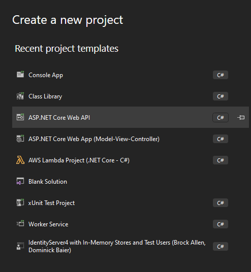

# Auth Series #5 - Call Microsoft Entra ID/Azure AD Protected Web API via ASP.NET Core MVC using Authorization Code Flow 


This is 5th tutorial of the **Auth Series**. Before we start, i really encourage you to read 
our previous #1 and #2 tutorials that will have same correlation used in this tutorial.

 - [Auth Series #1 - Microsoft Entra ID/Azure AD Authentication using ASP.NET Core MVC](https://github.com/mirzaevolution/Uptec-Entra-Id-Web-Login)
 - [Auth Series #2 - Protect ASP.NET Core Api with Microsoft Entra ID/Azure AD and Access It via Postman](https://github.com/mirzaevolution/Uptec-Protected-Web-Api)

In this tutorial, we will create a todo api using ASP.NET Core API 7x and let the Microsoft Entra ID/Azure ID 
as the authorization mechanism to protect our api (OAuth2/JWT). 
Next, we will also create a web app ASP.NET Core MVC 7x that will call our todo api. 
The web app will also get protected by Microsoft Entra ID/Azure AD via OpenID Connect Authorization Code Flow.

Here are the requirements used in this tutorial:

**Requirements:**

- Web Api Framework: ASP.NET Core API 7x
- Web App Framework: ASP.NET Core MVC 7x
- Nuget: Microsoft.Identity.Web and Microsoft.Identity.Web.DownstreamApi

### 1. Expose New API Scope

If you follow along our 2nd tutorial, we have created two new app registrations:

 - uptec-auth-api: This app registration used by our protected WeatherForecast api previously
 - uptec-auth-api-caller: This app registration used client apps to call the protected api


Now, select the **uptec-auth-api** or create new one, and take a note on the client id and tenant id of it.


Go to the **Expose an API** menu, we can see previously we have added a scope named **Access.Read**. 


Now, we need to add new scope named **Access.Write**. These scopes will be used by our API as additional checking mechanism. 
After JWT validated, the api controller can further check whether or not calling api has the required scopes.


Once the new scope created, don't forget to take a note on both scopes as well.


### 2. Register Our Web App and Add The New Scope 'Access.Write'

Switch to App Registration again, and now select the **uptec-auth-api-caller**.
In this page, take a note on the client id and tenant id as well.


Go to the **Certificates & secrets** menu, create new client secret and take a note on it as 
we will use this in the web app to call the api.


To register our web app url, we have to go to **Authentication** page, in the Web Platform, 
add new url `https://localhost:8282/signin-oidc` and `https://localhost:8282/signout-callback-oidc`.
This localhost port 8282 will be used by our application and the reason we register it in here is to 
make sure that we can login/logout and call the api properly.


The last step, we need to request/add new scope from **uptec-auth-api** we have created earlier.
Go to **API permissions**, Click "**Add a permission**" button, in the "**APIs my organization uses/My APIs**", search 
**uptec-auth-api** and select it. 


Select the new scope "**Access.Write**" we created earlier.


### 3. Create ASP.NET Core API - Todo API

Let's create web api for our Todo API. Follow our instructions below.




Go to the **launchSettings.json** and modify the content to be like this:

```
{
  "$schema": "https://json.schemastore.org/launchsettings.json",
  "profiles": {
    "https": {
      "commandName": "Project",
      "dotnetRunMessages": true,
      "launchBrowser": false,
      "applicationUrl": "https://localhost:8181;",
      "environmentVariables": {
        "ASPNETCORE_ENVIRONMENT": "Development"
      }
    }
  }
}

```


Go to the nuget package, please add the following nuget package as well 
`Microsoft.Identity.Web`.


Also, we need to modify the appsettings.json to hold the Azure Ad related informations like client id, tenant id, etc.

```
 "AzureAd": {
    "Instance": "https://login.microsoftonline.com/",
    "ClientId": "CLIENT_ID",
    "TenantId": "TENANT_ID",
    "Scopes": {
      "Write": "Access.Write",
      "Read": "Access.Read"
    }
  }
```


Now, let's add a few models for our todo api. These models include request model, dto and main model.


**CreateTodoRequest.cs**

```
using System.ComponentModel.DataAnnotations;

namespace UptecTodoApi.Models
{
    public class CreateTodoRequest
    {
        [Required]
        [MinLength(3)]
        [MaxLength(100)]
        public string Title { get; set; }
        public string Description { get; set; }
    }
}
```

**UpdateTodoRequest.cs**

```
using System.ComponentModel.DataAnnotations;

namespace UptecTodoApi.Models
{
    public class CreateTodoRequest
    {
        [Required]
        [MinLength(3)]
        [MaxLength(100)]
        public string Title { get; set; }
        public string Description { get; set; }
    }
}
```

**TodoDto.cs**

```
namespace UptecTodoApi.Models
{
    public class TodoDto
    {
        public Guid Id { get; set; }
        public string Title { get; set; }
        public string Description { get; set; }
    }
}

```

**TodoModel.cs**

```
namespace UptecTodoApi.Models
{
    public class TodoDto
    {
        public Guid Id { get; set; }
        public string Title { get; set; }
        public string Description { get; set; }
    }
}

```

Jump to the core logics, we will add TodoService to do CRUD process. The data will be stored to 
static list instance for simplicity.


**ITodoService.cs**

```
using UptecTodoApi.Models;

namespace UptecTodoApi.Services
{
    public interface ITodoService
    {
        Task<TodoDto> CreateAsync(TodoDto dto);
        Task<TodoDto> UpdateAsync(TodoDto dto);
        Task DeleteAsync(Guid id);
        Task<IEnumerable<TodoDto>> GetAllAsync();
        Task<TodoDto> GetAsync(Guid id);
    }
}

```

**TodoService.cs**

```
using UptecTodoApi.Models;

namespace UptecTodoApi.Services
{
    public class TodoService : ITodoService
    {
        private static readonly List<TodoModel> _todoList = new List<TodoModel>();
        public Task<TodoDto> CreateAsync(TodoDto dto)
        {
            _todoList.Add(ConvertToModel(dto));
            return Task.FromResult(dto);
        }

        public Task<TodoDto> UpdateAsync(TodoDto dto)
        {
            var model = _todoList.FirstOrDefault(x => x.Id == dto.Id);
            if (model == null)
                throw new Exception("Todo item not found");
            model.Title = dto.Title;
            model.Description = dto.Description;
            return Task.FromResult(dto);
        }

        public Task DeleteAsync(Guid id)
        {
            var model = _todoList.FirstOrDefault(x => x.Id == id);
            if (model == null)
                throw new Exception("Todo item not found");
            _todoList.Remove(model);
            return Task.CompletedTask;
        }

        public Task<IEnumerable<TodoDto>> GetAllAsync()
        {
            return Task.FromResult(_todoList.Select(ConvertFromModel));
        }

        public Task<TodoDto> GetAsync(Guid id)
        {
            var model = _todoList.FirstOrDefault(x => x.Id == id);
            if (model == null)
                throw new Exception("Todo item not found");
            return Task.FromResult(ConvertFromModel(model));
        }


        #region Private Methods
        private TodoModel ConvertToModel(TodoDto dto) => new TodoModel
        {
            Id = dto.Id,
            Title = dto.Title,
            Description = dto.Description
        };

        private TodoDto ConvertFromModel(TodoModel model) => new TodoDto
        {
            Id = model.Id,
            Title = model.Title,
            Description = model.Description
        };
        #endregion
    }
}

```

Once we have created models and services, now we need to register our service and also need to 
register **MicrosoftIdentityWebApiAuthentication** that will read our config in **Program.cs**.
Don't forget to add **UseAuthentication()** as well.

```
using Microsoft.Identity.Web;
using UptecTodoApi.Services;

namespace UptecTodoApi
{
    public class Program
    {
        public static void Main(string[] args)
        {
            var builder = WebApplication.CreateBuilder(args);
            var config = builder.Configuration;
            var services = builder.Services;

            services.AddControllers();
            services.AddMicrosoftIdentityWebApiAuthentication(config);

            services.AddScoped<ITodoService, TodoService>();

            var app = builder.Build();

            app.UseHttpsRedirection();

            app.UseAuthentication();
            app.UseAuthorization();

            app.MapControllers();

            app.Run();
        }
    }
}
```


The last step, we need to create **TodosController** for our api. 
This controller need to be decorated with **[Authorize]** attribute to protect the controller.


In the Read Access region block, we need to add 2 methods, Get Todo By Id and Get All Todos.
These methods will be decorated by **[RequiredScope(RequiredScopesConfigurationKey = "AzureAd:Scopes:Read")]** that will make sure 
these 2 methods must have **Access.Read** scope we defined in the Azure Portal. The **RequiredScope** attribute will read the config value in 
the **appsettings.json** we modified above.


In another hand, we will also create Post, Put and Delete methods and will be decorated with 
**[RequiredScope(RequiredScopesConfigurationKey = "AzureAd:Scopes:Write")]**. The same with above, it will check 
the scope existence of **Access.Write** scope.


**TodosController.cs**

```
using Microsoft.AspNetCore.Authorization;
using Microsoft.AspNetCore.Mvc;
using Microsoft.Identity.Web.Resource;
using UptecTodoApi.Models;
using UptecTodoApi.Services;

namespace UptecTodoApi.Controllers
{
    [Route("api/[controller]")]
    [ApiController]
    [Authorize]
    public class TodosController : ControllerBase
    {
        private readonly ITodoService _todoService;

        public TodosController(ITodoService todoService)
        {
            _todoService = todoService;
        }

        #region Read Access
        [HttpGet("{id:guid}")]
        [RequiredScope(RequiredScopesConfigurationKey = "AzureAd:Scopes:Read")]
        public async Task<IActionResult> Get(Guid id)
        {
            var dto = await _todoService.GetAsync(id);
            return Ok(dto);
        }

        [HttpGet]
        [RequiredScope(RequiredScopesConfigurationKey = "AzureAd:Scopes:Read")]
        public async Task<IActionResult> Get()
        {
            var dtoList = await _todoService.GetAllAsync();
            return Ok(dtoList);
        }
        #endregion

        #region Write Access
        [HttpPost]
        [RequiredScope(RequiredScopesConfigurationKey = "AzureAd:Scopes:Write")]
        public async Task<IActionResult> Post([FromBody] CreateTodoRequest request)
        {
            if (ModelState.IsValid)
            {
                var dto = await _todoService.CreateAsync(new TodoDto
                {
                    Id = Guid.NewGuid(),
                    Title = request.Title,
                    Description = request.Description
                });
                return Ok(dto);
            }
            return BadRequest();
        }

        [HttpPut]
        [RequiredScope(RequiredScopesConfigurationKey = "AzureAd:Scopes:Write")]
        public async Task<IActionResult> Put([FromBody] UpdateTodoRequest request)
        {
            if (ModelState.IsValid)
            {
                var dto = await _todoService.UpdateAsync(new TodoDto
                {
                    Id = request.Id,
                    Title = request.Title,
                    Description = request.Description
                });
                return Ok(dto);
            }
            return BadRequest();
        }

        [HttpDelete("{id:guid}")]
        [RequiredScope(RequiredScopesConfigurationKey = "AzureAd:Scopes:Write")]
        public async Task<IActionResult> Delete(Guid id)
        {
            await _todoService.DeleteAsync(id);
            return NoContent();
        }


        #endregion
    }
}

```

All right, let's test our api using Postman. Make sure you follow our 2nd **Auth Series** tutorial that explained 
on how to call protected api via Postman.


Great!! Our api worked. We can now focus on the Web App!


### 3. Setup ASP.NET Core MVC Calling App - Todo App

We will be using ASP.NET Core MVC 7x project. Make sure to follow below steps.


Now, install 2 nuget packages:

- Microsoft.Identity.Web
- Microsoft.Identity.Web.DownstreamApi

**Microsoft.Identity.Web.DownstreamApi** is an extension of **Microsoft.Identity.Web** that will have a helper 
that can be used to call protected api and does the caching and incremental consent automatically.

Once the nuget packages got installed, modify the **appsettings.json** as below.

```
{
  "Logging": {
    "LogLevel": {
      "Default": "Information",
      "Microsoft.AspNetCore": "Warning"
    }
  },
  "AllowedHosts": "*",
  "AzureAd": {
    "ClientId": "CLIENT_ID",
    "ClientSecret": "CLIENT_SECRET",
    "TenantId": "TENANT_ID",
    "Instance": "https://login.microsoftonline.com/",
    "CallbackPath": "/signin-oidc",
    "SignedOutCallbackPath": "/signout-callback-oidc"
  },
  "TodoApi": {
    "BaseUrl": "https://localhost:8181",
    "Path": "/api/todos",
    "Scopes": [
      "api://3a9b9211-6791-4992-b779-bb05935f708b/Access.Read",
      "api://3a9b9211-6791-4992-b779-bb05935f708b/Access.Write"
    ]
  }
}

```


As we can see, we need to have client secret we created earlier to call our api. 
We also specify complete scope names (with identifier api://....). 
Don't forget to set the base url of the TodoApi to be the same like our api has.

Now, jump to **Program.cs**. Modify the file to add authentication mechanism via 
**AddMicrosoftIdentityWebAppAuthentication**. This method will have extension methods of
**EnableTokenAcquisitionToCallDownstreamApi** and **AddDownstreamApi**.
Those extension methods will register our api defined in the **appsettings.json**. 
So, to call the api, we later just need to inject IDownstreamApi interface and call it via that interface.
We also enable MemoryTokenCaches that will store our token in the memory after we got it. 
You can also use distributed caching like Redis, SQL Server etc.

**Program.cs**

```

using Microsoft.AspNetCore.Authentication.Cookies;
using Microsoft.Identity.Web;
namespace UptecWebAppCallsProtectedApi
{
    public class Program
    {
        public static void Main(string[] args)
        {
            var builder = WebApplication.CreateBuilder(args);
            var config = builder.Configuration;
            var services = builder.Services;

            string todoApiName = "TodoApi";

            services.AddMicrosoftIdentityWebAppAuthentication(config)
                .EnableTokenAcquisitionToCallDownstreamApi()
                .AddDownstreamApi(todoApiName, config.GetSection(todoApiName))
                .AddInMemoryTokenCaches();

            services.Configure<CookieAuthenticationOptions>(options =>
            {
                options.LoginPath = new PathString("/Auth/Login");
                options.LogoutPath = new PathString("/Auth/Logout");
                options.ReturnUrlParameter = "redirectUrl";
            });

            services.AddControllersWithViews();
            var app = builder.Build();
            if (!app.Environment.IsDevelopment())
            {
                app.UseExceptionHandler("/Home/Error");
                app.UseHsts();
            }
            app.UseHttpsRedirection();
            app.UseStaticFiles();
            app.UseRouting();
            app.UseAuthentication();
            app.UseAuthorization();

            app.MapControllerRoute(
                name: "default",
                pattern: "{controller=Home}/{action=Index}/{id?}");

            app.Run();
        }
    }
}
```


We also customize default authentication controller in above code. 
Now, let's create AuthController and put the code as below.

**AuthController.cs**

```
using Microsoft.AspNetCore.Authentication;
using Microsoft.AspNetCore.Authentication.Cookies;
using Microsoft.AspNetCore.Authentication.OpenIdConnect;
using Microsoft.AspNetCore.Authorization;
using Microsoft.AspNetCore.Mvc;

namespace UptecWebAppCallsProtectedApi.Controllers
{
    public class AuthController : Controller
    {
        public IActionResult Login(string redirectUrl = "/")
        {
            return Challenge(new AuthenticationProperties
            {
                RedirectUri = Url.IsLocalUrl(redirectUrl) ?
                    redirectUrl : Url.Action("Index", "Home", null, Request.Scheme)
            },
                OpenIdConnectDefaults.AuthenticationScheme);
        }

        [Authorize]
        public IActionResult Logout()
        {
            return SignOut(
                OpenIdConnectDefaults.AuthenticationScheme,
                CookieAuthenticationDefaults.AuthenticationScheme);
        }
    }
}

```

Modify the **_Layout.cshtml** and include the login logout buttons in the right side-nav.


**_Layout.cshtml**

```
<!DOCTYPE html>
<html lang="en">
<head>
    <meta charset="utf-8" />
    <meta name="viewport" content="width=device-width, initial-scale=1.0" />
    <title>@ViewData["Title"] - UptecWebAppCallsProtectedApi</title>
    <link rel="stylesheet" href="~/lib/bootstrap/dist/css/bootstrap.min.css" />
    <link rel="stylesheet" href="~/css/site.css" asp-append-version="true" />
    <link rel="stylesheet" href="~/UptecWebAppCallsProtectedApi.styles.css" asp-append-version="true" />
</head>
<body>
    <header>
        <nav class="navbar navbar-expand-sm navbar-toggleable-sm navbar-light bg-white border-bottom box-shadow mb-3">
            <div class="container-fluid">
                <a class="navbar-brand" asp-area="" asp-controller="Home" asp-action="Index">Todo App</a>
                <button class="navbar-toggler" type="button" data-bs-toggle="collapse" data-bs-target=".navbar-collapse" aria-controls="navbarSupportedContent"
                        aria-expanded="false" aria-label="Toggle navigation">
                    <span class="navbar-toggler-icon"></span>
                </button>
                <div class="navbar-collapse collapse d-sm-inline-flex justify-content-between">
                    <ul class="navbar-nav flex-grow-1">
                        <li class="nav-item">
                            <a class="nav-link text-dark" asp-area="" asp-controller="Home" asp-action="Index">Home</a>
                        </li>
                        <li class="nav-item">
                            <a class="nav-link text-dark" asp-area="" asp-controller="Todos" asp-action="Index">Todos</a>
                        </li>
                        <li class="nav-item">
                            <a class="nav-link text-dark" asp-area="" asp-controller="Home" asp-action="Privacy">Privacy</a>
                        </li>
                    </ul>
                    <ul class="navbar-nav ms-auto">
                        @if (User.Identity.IsAuthenticated)
                        {
                            <li class="nav-item">
                                <a class="nav-link text-dark" href="#">@User.Identity.Name</a>
                            </li>
                            <li class="nav-item">
                                <a class="nav-link text-dark" asp-area="" asp-controller="Auth" asp-action="Logout">Logout</a>
                            </li>
                        }
                        else
                        {
                            <li class="nav-item">
                                <a class="nav-link text-dark" asp-area="" asp-controller="Auth" asp-action="Login">Login</a>
                            </li>
                        }
                    </ul>
                </div>
            </div>
        </nav>
    </header>
    <div class="container">
        <main role="main" class="pb-3">
            @RenderBody()
        </main>
    </div>

    <footer class="border-top footer text-muted">
        <div class="container">
            &copy; 2024 - UptecWebAppCallsProtectedApi - <a asp-area="" asp-controller="Home" asp-action="Privacy">Privacy</a>
        </div>
    </footer>
    <script src="~/lib/jquery/dist/jquery.min.js"></script>
    <script src="~/lib/bootstrap/dist/js/bootstrap.bundle.min.js"></script>
    <script src="~/js/site.js" asp-append-version="true"></script>
    @await RenderSectionAsync("Scripts", required: false)
</body>
</html>

```

Create another controller and give the name -> **TodosController**. 
This controller will be the entry point to fetch or post data through our api endpoint.
It will have Create, Edit+Delete and List pages **(ignore the logic and focus on the screenshot next)**.

**TodosController.cs**

```
using Microsoft.AspNetCore.Authorization;
using Microsoft.AspNetCore.Mvc;
using Microsoft.Identity.Abstractions;
using Microsoft.Identity.Web;
using UptecWebAppCallsProtectedApi.Models;

namespace UptecWebAppCallsProtectedApi.Controllers
{
    [Authorize]
    [AuthorizeForScopes(ScopeKeySection = "TodoApi:Scopes")]
    public class TodosController : Controller
    {
        private readonly IDownstreamApi _downstreamApi;
        private readonly IConfiguration _configuration;
        private readonly string _apiName = "TodoApi";
        private readonly string _relativePath;
        public TodosController(
                IDownstreamApi downstreamApi,
                IConfiguration configuration
            )
        {
            _downstreamApi = downstreamApi;
            _configuration = configuration;
            _relativePath = _configuration[$"{_apiName}:Path"]
                        ?? throw new Exception("Path configuration is empty/null");
        }

        public async Task<IActionResult> Index()
        {
            IEnumerable<TodoModel>? todos = await _downstreamApi
                .GetForUserAsync<IEnumerable<TodoModel>>(_apiName, options =>
                {
                    options.RelativePath = _relativePath;
                }
            );
            return View(todos);
        }

        public IActionResult Create() => View(default(CreateTodoViewModel));

        [HttpPost]
        [ValidateAntiForgeryToken]
        public async Task<IActionResult> Create(CreateTodoViewModel vm)
        {
            if (ModelState.IsValid)
            {
                await _downstreamApi
                    .PostForUserAsync<CreateTodoViewModel, TodoModel>(_apiName, vm,
                    options =>
                    {
                        options.RelativePath = _relativePath;
                    });
                return RedirectToAction(nameof(Index), "Todos");
            }
            return View(vm);
        }

        public async Task<IActionResult> Edit(Guid id)
        {
            var todo = await _downstreamApi.GetForUserAsync<TodoModel>(_apiName,
                options =>
            {
                options.RelativePath = _relativePath + $"/{id}";

            });

            return View(todo != null ? new UpdateTodoViewModel
            {
                Id = todo.Id,
                Title = todo.Title,
                Description = todo.Description
            } : null);
        }

        [HttpPost]
        [ValidateAntiForgeryToken]
        public async Task<IActionResult> Edit(UpdateTodoViewModel vm)
        {

            if (ModelState.IsValid)
            {
                await _downstreamApi
                    .PutForUserAsync<UpdateTodoViewModel, TodoModel>(_apiName, vm,
                    options =>
                    {
                        options.RelativePath = _relativePath;
                    });
                return RedirectToAction(nameof(Index), "Todos");
            }
            return View(vm);
        }

        [HttpPost]
        [ValidateAntiForgeryToken]
        public async Task<IActionResult> Delete(Guid id)
        {
            await _downstreamApi.CallApiForUserAsync(_apiName, options =>
            {
                options.RelativePath = _relativePath + $"/{id}";
                options.HttpMethod = HttpMethods.Delete;
            });

            return RedirectToAction(nameof(Index), "Todos");

        }

    }
}

```


We decorated our controller with **Authorize** attribute and **AuthorizeForScopes** attribute. 
The **AuthorizeForScopes** attribute will make sure that our controller will have additional checking 
mechanism. It will check whether or not the authorized user has the **Access.Read** & **Access.Write** scopes we defined earlier. 
This attribute will read the scope list from our **appsettings.json -> TodoApi:Scopes**.

The next thing is, we also inject the **IDownstreamApi** interface. This interface has few helper methods for us 
to call an api like **HttpClient** instance does. The difference is, we don't need to care about caching or setting the access token to the 
authorization header like we did in **HttpClient**.

The methods exposed by **IDownstreamApi** are also clear. Like GetForUserAsync, PostForUserAsync etc. If you are building 
machine-to-machine apps, we need to use something like GetForAppAsync, PostForAppAsync etc instead.


After controller finished, we will create all the models and views as well.

Starting with models, create below classes to support our controller above inside the **Models** folder.

**CreateTodoViewModel.cs**

```
using System.ComponentModel.DataAnnotations;

namespace UptecWebAppCallsProtectedApi.Models
{
    public class CreateTodoViewModel
    {
        [Required]
        [MinLength(3)]
        [MaxLength(100)]
        public string Title { get; set; }
        public string Description { get; set; }
    }
}
```

**UpdateTodoViewModel.cs**

```
using System.ComponentModel.DataAnnotations;

namespace UptecWebAppCallsProtectedApi.Models
{
    public class UpdateTodoViewModel
    {
        public Guid Id { get; set; }
        [Required]
        [MinLength(3)]
        [MaxLength(100)]
        public string Title { get; set; }
        public string Description { get; set; }
    }
}
```

**TodoModel.cs**

```
namespace UptecWebAppCallsProtectedApi.Models
{
    public class TodoModel
    {
        public Guid Id { get; set; } = Guid.NewGuid();
        public string Title { get; set; }
        public string Description { get; set; }
    }
}

```


Next, create the views as defined below under folder -> **Views > Todos**

**Create.cshtml**

```
@model UptecWebAppCallsProtectedApi.Models.CreateTodoViewModel

@{
    ViewData["Title"] = "New Todo Item";
}

<h2>Add New Todo Item</h2>
<hr />
<div class="row mt-2">
    <div class="col-md-6">
        <form asp-action="Create">
            <div asp-validation-summary="ModelOnly" class="text-danger"></div>
            <div class="form-group mb-4">
                <label asp-for="Title" class="control-label"></label>
                <input asp-for="Title" class="form-control" />
                <span asp-validation-for="Title" class="text-danger"></span>
            </div>
            <div class="form-group mb-4">
                <label asp-for="Description" class="control-label"></label>
                <input asp-for="Description" class="form-control" />
                <span asp-validation-for="Description" class="text-danger"></span>
            </div>
            <div class="form-group mb-2">
                <input type="submit" value="Save" class="btn btn-primary" />
            </div>
        </form>
    </div>
</div>

<a asp-action="Index" class="btn btn-outline-info d-inline-block mr-1">
    Back to List
</a>
@section Scripts {
    @{await Html.RenderPartialAsync("_ValidationScriptsPartial");}
}

```

**Edit.cshtml**

```
@model UptecWebAppCallsProtectedApi.Models.UpdateTodoViewModel

@{
    ViewData["Title"] = "Edit Todo Item";
}

<h2>Edit Todo Item</h2>
<hr />
@if(Model!=null)
{
    <div class="row mt-2">
        <div class="col-md-6">
            <form asp-action="Edit">
                <div asp-validation-summary="ModelOnly" class="text-danger"></div>
                <input type="hidden" asp-for="Id"/>
                <div class="form-group mb-4">
                    <label asp-for="Title" class="control-label"></label>
                    <input asp-for="Title" class="form-control" />
                    <span asp-validation-for="Title" class="text-danger"></span>
                </div>
                <div class="form-group mb-4">
                    <label asp-for="Description" class="control-label"></label>
                    <input asp-for="Description" class="form-control" />
                    <span asp-validation-for="Description" class="text-danger"></span>
                </div>
                <div class="form-group mb-4">
                    <input type="submit" value="Save" class="btn btn-primary" />
                    
                </div>
            </form>
        </div>
    </div>

    <div>
        <a asp-action="Index" class="btn btn-outline-info d-inline-block mr-1">
            Back to List
        </a>
        <form asp-action="Delete" id="formDelete" class="d-inline-block">
            <input type="hidden" asp-for="Id" />

            <button class="btn btn-outline-danger" type="submit">
                Delete
            </button>
        </form>
    </div>

}
else
{
    <p class="text-danger">Invalid data. Todo item is not found</p>
}
@section Scripts {
    @{await Html.RenderPartialAsync("_ValidationScriptsPartial");}
    <script>
        function deleteTodo(event) {
            event.preventDefault();
            let confirmed = window.confirm('Are you sure want to delete this data?');
            if (confirmed) {
                document.getElementById('formDelete').submit();
            }
        }
        document.getElementById('formDelete')?.addEventListener('submit', deleteTodo)
        
    </script>
}

```

**Index.cshtml**

```
@model IEnumerable<TodoModel>
@{
    ViewData["Title"] = "Todo Items";
}
<div class="mt-5 mx-3">
    <a asp-action="Create" asp-controller="Todos" class="btn btn-success">Add New Item</a>
</div>
<div class="mt-4 mx-3">

    @if (Model != null && Model.Any())
    {
        foreach (var item in Model)
        {
            <div class="card mt-4 col-12">
                <div class="card-header bg-primary">
                    <h3 class="card-title text-light mx-2">@item.Title</h3>
                </div>
                <div class="card-body">
                    <div class="m-2"> @item.Description</div>
                </div>
                <div class="card-footer">
                    <a asp-action="Edit" asp-controller="Todos"
                       asp-route-id="@item.Id" class="btn btn-outline-primary">Edit</a>
                </div>
            </div>
        }
    }
    else
    {
        <p>No todo item found.</p>
    }
</div>
```

Great job! We have defined all the required components. Now, let's run both applications.
Make sure you run the api first then the web app. 

After both are running, just do the login process in web app and start accessing the Todos page in the navbar menu.


Ok, i think that's all for this tutorial. You can check both source code of the projects below:


> Web Api: https://github.com/mirzaevolution/UptecTodoApi

> Web App: https://github.com/mirzaevolution/Uptec-Web-App-Calls-Protected-Api-Authorization-Code-Flow


Regards,

**Mirza Ghulam Rasyid**